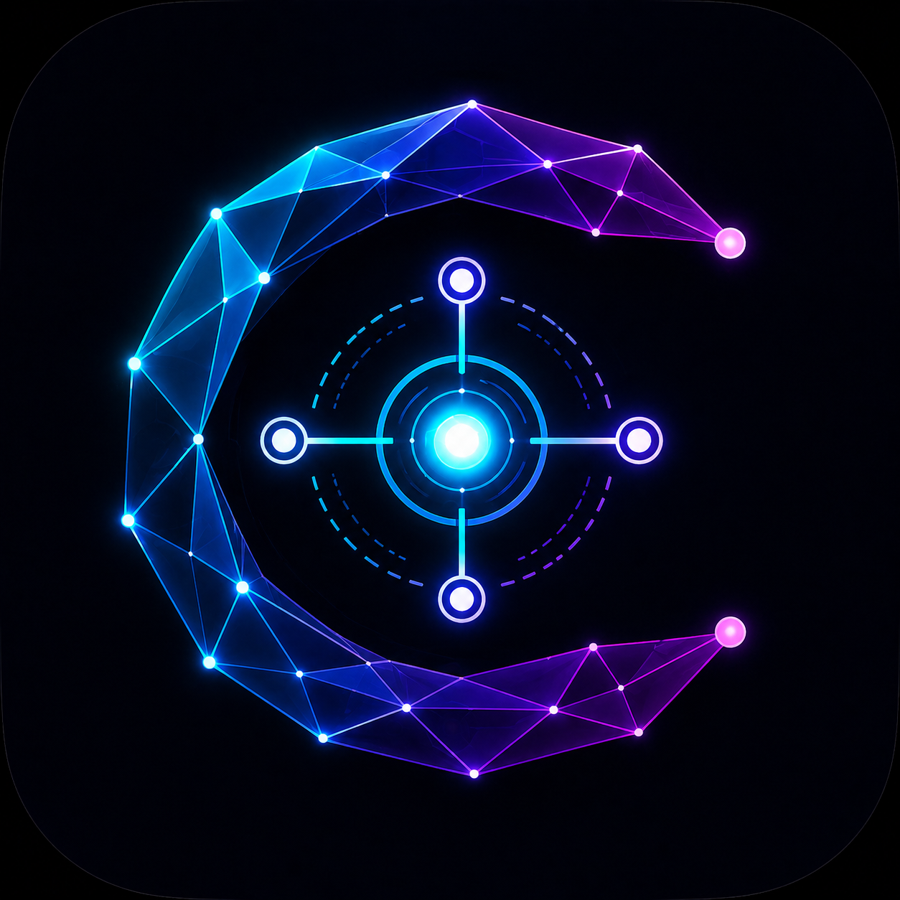
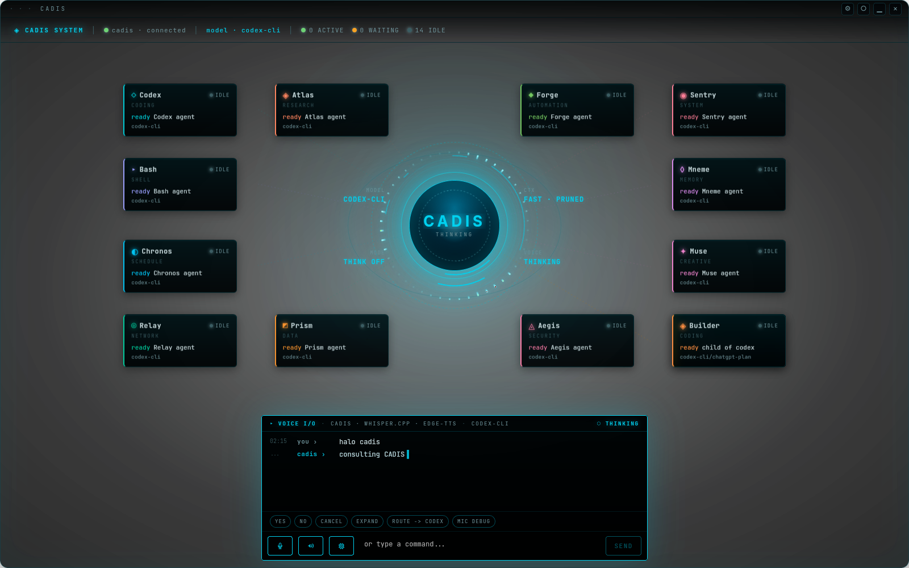

<p align="center">
  
</p>

<h1 align="center">C.A.D.I.S.</h1>

<p align="center"><strong>Coordinated Agentic Distributed Intelligence System</strong></p>

<p align="center">
  Local-first multi-agent runtime for desktop work, native tools, approvals, voice, and isolated coding workflows.
</p>

<p align="center">
  <a href="LICENSE"></a>
  
  
  
  
</p>

<p align="center">
  
</p>

<p align="center">
  <sub>C.A.D.I.S. HUD: local daemon status, orbital agents, voice I/O, model routing, and approval-aware desktop control.</sub>
</p>

<p align="center">
  
</p>

<p align="center">
  <sub>Wulan avatar direction: renderer-neutral identity, presence, and expression layer for future C.A.D.I.S. clients.</sub>
</p>

C.A.D.I.S. is a Rust-first, local-first, model-agnostic runtime for coordinating
AI agents across a desktop HUD, CLI, voice, approvals, native tools, and
isolated coding work. The repository and binaries stay lowercase as `cadis` and
`cadisd`, while the public product name is written as **C.A.D.I.S.**

The daemon, `cadisd`, is the runtime authority. Every interface, whether CLI,
HUD, voice, or future Telegram/mobile surfaces, is a protocol client rather
than a separate backend.

```text
HUD / CLI / Voice / Telegram / Android
                |
              cadisd
                |
     agents, models, tools, policy, store
```

## Why C.A.D.I.S. exists

Modern AI tooling is often fragmented across browser tabs, terminal sessions,
background scripts, and app-specific state. C.A.D.I.S. brings that control
plane into one local daemon with typed events, explicit approvals, and runtime
boundaries that stay inspectable.

It is meant to feel like an operating layer, not a chatbot wrapper.

## Design principles

- **Local-first**: state, logs, approvals, and orchestration live on your machine.
- **Rust-first core**: critical runtime paths stay in Rust for predictability and performance.
- **Model-agnostic**: support local and remote providers behind one daemon contract.
- **Policy-gated**: risky actions must pass centralized approval and audit paths.
- **Interface-agnostic**: the daemon owns runtime behavior; clients render and control it.
- **Workload-aware**: code-heavy tasks should flow differently from normal chat.

## Current status

C.A.D.I.S. is currently **pre-alpha**.

The repository already includes a meaningful desktop MVP foundation:

- `cadisd`: local daemon and protocol authority
- `cadis`: CLI client for status, models, agents, spawn, chat, tools, and doctor checks
- `apps/cadis-hud`: Tauri + React HUD prototype
- `crates/cadis-avatar`: renderer-neutral Wulan avatar state engine contract,
  with a feature-gated adapter-ready wgpu render-plan spike
- typed protocol events for messages, models, agents, approvals, workspaces, orchestrator routing, and workers
- JSONL event persistence with redaction boundaries
- profile-local agent homes, workspace registry, and grants for safe-read tools
- optional Ollama, OpenAI API, and Codex CLI model adapters
- official Codex CLI adapter for ChatGPT Plus/Pro login flows
- HUD-local Edge TTS playback, `whisper-cli` voice input, and voice doctor preflight

Planned work still includes production-grade mutating tool execution, full
policy coverage, richer worker isolation, Telegram/mobile clients,
daemon-owned production voice, and code work windows. The workspace
architecture is partially implemented; real worker worktree creation,
checkpoint rollback, dedicated profile/agent doctor commands, and project media
manifests remain next.

## Core capabilities

### 1. Daemon-owned runtime

C.A.D.I.S. keeps execution authority inside `cadisd`. UI clients do not own
agent orchestration, tool policy, or approval state.

### 2. Multi-agent control surface

The system is built to manage a main orchestrator plus specialist agents,
workers, and background tasks through one event protocol.

### 3. Native tool runtime

Core capabilities are intended to be native tools first, not just external
bridges. Early runtime coverage includes read-only file and git flows, approval
gates for risky actions, and a workspace-aware execution model.

### 4. Approval and policy boundaries

Risk classification, approval state, and audit visibility are first-class parts
of the architecture, not an afterthought.

### 5. Multiple interfaces

The same daemon is meant to serve:

- CLI workflows
- desktop HUD workflows
- voice-enabled control
- future Telegram and remote surfaces

### 6. Avatar and presence engine

C.A.D.I.S. also treats identity, expression, and presence as first-class runtime
concerns. The `cadis-avatar` crate is the renderer-neutral contract for Wulan
avatar state so HUD, voice, and future remote clients can render a consistent
presence without moving core orchestration out of `cadisd`.

## Quick start

### Build from source

```bash
cargo build --release
```

### Start the daemon

```bash
target/release/cadisd --check
target/release/cadisd
```

### Use the CLI

```bash
target/release/cadis status
target/release/cadis doctor
target/release/cadis models
target/release/cadis agents
target/release/cadis chat "hello"
```

### Run the HUD

```bash
cd apps/cadis-hud
corepack enable
pnpm install
pnpm tauri:dev
```

The HUD resolves the daemon socket from `CADIS_HUD_SOCKET`, `CADIS_SOCKET`,
`~/.cadis/config.toml`, `$XDG_RUNTIME_DIR/cadis/cadisd.sock`, or
`~/.cadis/run/cadisd.sock`.

## Model provider setup

Default mode is `auto`: C.A.D.I.S. tries Ollama at
`http://127.0.0.1:11434`, then falls back to a local credential-free response
if Ollama is unavailable.

For OpenAI API billing, set `[model].provider = "openai"` and provide either
`CADIS_OPENAI_API_KEY` or `OPENAI_API_KEY` in the daemon environment.

For ChatGPT Plus/Pro through the official Codex CLI:

```bash
codex login
```

Then configure:

```toml
[model]
provider = "codex-cli"
```

C.A.D.I.S. does not store ChatGPT credentials directly; the official Codex CLI
owns that authentication flow.

## Voice

The HUD can speak final C.A.D.I.S. replies through Edge TTS. For microphone
input, the HUD records locally and asks Tauri to transcribe via `whisper-cli`.
On WebKitGTK, C.A.D.I.S. also records WebAudio PCM in parallel so voice can
still transcribe when `MediaRecorder` sees the mic but produces zero chunks.

```bash
export CADIS_WHISPER_CLI="$HOME/.local/bin/whisper-cli"
export CADIS_WHISPER_MODEL="$HOME/.local/share/cadis/whisper-models/ggml-base.bin"
```

On Linux, if desktop portal permissions block the microphone, allow mic access
for C.A.D.I.S. in system settings and retry from the HUD.

The HUD Settings -> Voice tab includes a local voice doctor that checks renderer
mic status, WebAudio analyser/PCM fallback telemetry, `whisper-cli`, the
configured Whisper model, Node helper execution, and available audio players.

## Repository layout

```text
cadis/
|-- apps/                  # Tauri HUD and future apps
|-- config/                # Example configuration
|-- crates/                # Rust daemon, CLI, protocol, policy, store, models
|-- docs/                  # Product, architecture, protocol, and standards docs
|   `-- assets/            # Documentation images and README media
|-- examples/              # Example configs and usage flows
|-- skills/                # Project-local contributor skills
|-- AGENT.md               # Coding-agent guidance
|-- Cargo.toml             # Rust workspace manifest
|-- SECURITY.md
`-- LICENSE
```

## Documentation

- [Project Charter](docs/00_PROJECT_CHARTER.md)
- [Architecture](docs/05_ARCHITECTURE.md)
- [Implementation Plan](docs/06_IMPLEMENTATION_PLAN.md)
- [Master Checklist](docs/07_MASTER_CHECKLIST.md)
- [Open Source Standard](docs/09_OPEN_SOURCE_STANDARD.md)
- [Protocol Draft](docs/15_PROTOCOL_DRAFT.md)
- [Configuration Reference](docs/16_CONFIG_REFERENCE.md)
- [Developer Setup](docs/17_DEVELOPER_SETUP.md)
- [Installation](docs/18_INSTALLATION.md)
- [RamaClaw UI Adaptation](docs/20_RAMACLAW_UI_ADAPTATION.md)
- [UI State Protocol Contract](docs/22_UI_STATE_PROTOCOL_CONTRACT.md)
- [UI Design System](docs/23_UI_DESIGN_SYSTEM.md)
- [Memory Concept](docs/25_MEMORY_CONCEPT.md)
- [Wulan Avatar Engine](docs/26_WULAN_AVATAR_ENGINE.md)
- [Workspace Architecture](docs/27_WORKSPACE_ARCHITECTURE.md)

## Contributing

Start with [AGENT.md](AGENT.md), [CONTRIBUTING.md](CONTRIBUTING.md), and
[docs/standards/00_STANDARD_INDEX.md](docs/standards/00_STANDARD_INDEX.md).

If you want to propose a product direction, protocol change, tool-runtime
change, or UX concept, use GitHub Discussions first so design feedback can land
before implementation drift.

## Security

C.A.D.I.S. is built to keep credentials out of git and logs. Local auth
artifacts, tokens, `.env` files, JSONL traces, sockets, and crash diagnostics
are ignored by default. See [SECURITY.md](SECURITY.md) for reporting and
handling guidance.

## License

C.A.D.I.S. is licensed under the Apache License 2.0.
