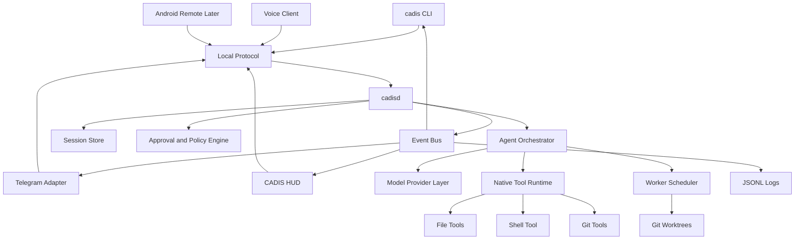
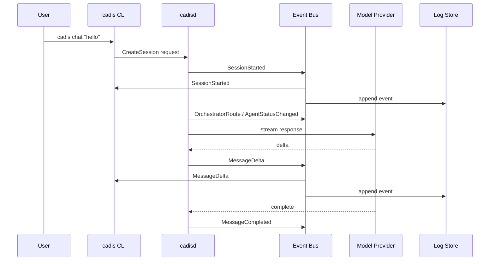
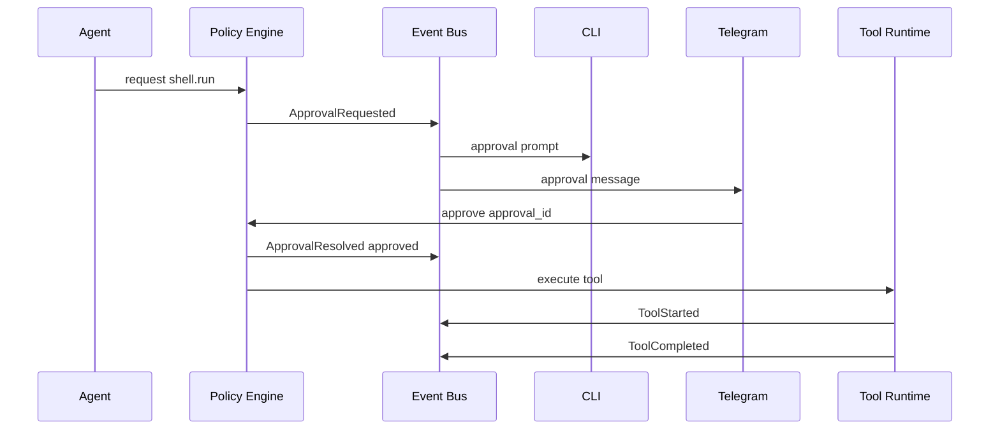

# CADIS Architecture

## 1. Architecture Summary

CADIS uses a daemon-first architecture. `cadisd` owns sessions, agents, tools, policy, event routing, persistence, and model interaction. All user interfaces are clients.

```text
                 Telegram
                    |
CLI ----------- local protocol ----------- HUD
                    |
                  cadisd
                    |
      +-------------+--------------+
      |             |              |
  Event Bus   Agent Runtime   Policy Engine
      |             |              |
  Persistence   Tools       Approvals
                    |
              Model Providers
```

## 2. High-Level Component Diagram



## 3. Runtime Boundary

### Core

- daemon
- local protocol
- event bus
- sessions
- model provider abstraction
- native tools
- policy engine
- persistence
- agent scheduler

### Adapters

- CLI
- Telegram
- HUD
- code work window
- voice
- optional Wulan avatar renderer
- model provider implementations
- optional MCP bridge later

Adapters may format, display, and relay events. They must not own business logic for tools, policy, or agent orchestration.

The Wulan avatar state engine is a library boundary, not runtime authority.
`crates/cadis-avatar` converts daemon-derived HUD state into renderable
`AvatarFrame` values, including body gesture state, face pose, material hints,
privacy metadata, and direct-wgpu uniform data. A concrete `wgpu` renderer may
consume that contract later; Bevy remains optional and deferred. The HUD must
fall back to the default CADIS orb if native avatar rendering fails.

## 4. Request Flow



`cadisd` prepares message routing and session state under the runtime mutex, but
model provider generation runs outside that mutex. The daemon reacquires the
runtime only to create authoritative event envelopes, so unrelated status and
agent-list requests can proceed while a slow provider is generating.

## 5. Approval Flow



Rules:

- Approval request is created before execution.
- Each approval has one authoritative state.
- First valid response wins.
- Denied or expired approvals do not execute.
- All clients receive the final state.

## 6. Coding Work Flow

```text
user task
  -> session created
  -> task classified as code-heavy
  -> code work context created
  -> worker created
  -> worker event emits planned worktree and artifact locations
  -> git worktree created
  -> coding agent edits in worktree
  -> tester runs tests
  -> reviewer checks diff
  -> code window shows patch and logs
  -> user approves apply
  -> patch applied to target workspace
```

The main conversation remains readable. Diffs, logs, and test output go to the code work window.

## 7. Event Model

Important event families:

```text
# Session
session.started
session.completed
message.delta
message.completed

# Agent
agent.spawned
agent.status.changed
agent.completed
agent.session.started
agent.session.completed
agent.session.failed
agent.session.cancelled

# Worker
worker.started
worker.log.delta
worker.completed
worker.cancelled
worker.cleanup.requested

# Tool & Approval
tool.requested
tool.started
tool.completed
tool.failed
approval.requested
approval.resolved
patch.created
test.result

# Voice
voice.started
voice.completed
voice.preview.started
voice.preview.completed
voice.preview.failed
voice.status.updated
voice.doctor.response
voice.preflight.response

# Daemon
daemon.started
daemon.stopping
daemon.error

# Routing & UI
orchestrator.route
ui.preferences.updated
models.list.response
```

All events must be serializable and durable enough for logs.

Worker lifecycle events carry intent before side effects. The baseline daemon may
emit `worktree.state = planned` with branch and path metadata without creating a
git worktree. A later worker runtime is responsible for turning that intent into
`git.worktree.create` tool execution after workspace grants, policy, and
approval checks have passed.

## 8. Content Routing

Every output should declare a content kind:

```text
chat
summary
code
diff
terminal_log
test_result
approval
error
```

Routing rules:

| Content kind | HUD | CLI | Telegram | Voice | Code Window |
| --- | --- | --- | --- | --- | --- |
| chat | Show | Show | Optional | Speak if enabled | No |
| summary | Show | Show | Push | Speak if enabled | Optional |
| code | Link | Link | Summary | Short summary only | Show |
| diff | Link | Link | Summary | No | Show |
| terminal_log | Link | Tail | Summary | No | Show |
| test_result | Show summary | Show summary | Push summary | Short summary | Show |
| approval | Card | Prompt | Buttons | Risk summary | Optional |
| error | Show | Show | Push | Actionable summary | Optional |

## 9. Agent Tree

Agents are represented as nodes:

```text
main
|-- coder
|   |-- tester
|   `-- reviewer
`-- researcher
```

Default limits:

```toml
[agents]
max_depth = 2
max_children_per_agent = 4
max_global_agents = 32
default_timeout_sec = 900
allow_recursive_spawn = true
```

The desktop MVP now wraps each routed task in an in-memory daemon-owned
`AgentSession`. The record carries the route ID, task summary, result/error
summary, timeout deadline, step budget, cancellation timestamp, target agent,
and parent agent. Clients observe it through `agent.session.started`,
`agent.session.updated`, and terminal `agent.session.completed`,
`agent.session.failed`, or `agent.session.cancelled` events. AgentSession
metadata is also written atomically under `~/.cadis/state/agent-sessions/` and
loaded on daemon start so `events.snapshot` can replay recovered records.
Provider/tool-loop execution and implicit model-driven spawning remain later
work.

## 10. Model Provider Layer

Provider interface responsibilities:

- stream response events
- expose capabilities
- map provider errors to CADIS errors
- support cancellation
- support tool call metadata when available

Initial providers:

- OpenAI
- Ollama
- Anthropic
- Gemini
- OpenRouter
- LM Studio
- custom HTTP

The provider contract should be proven with one cloud provider and one local provider before broad expansion.

## 11. Tool Runtime

Tools are native Rust components first.

Each tool declares:

- name
- description
- input schema
- output schema
- risk class
- workspace behavior
- timeout behavior
- cancellation behavior

MCP can be added later as an extension bridge, not as the default mechanism for core tools.

## 12. Persistence Architecture

```text
~/.cadis/
|-- config.toml
|-- profiles/
|   `-- default/
|       |-- profile.toml
|       |-- agents/
|       |-- workspaces/
|       |   |-- registry.toml
|       |   `-- grants.jsonl
|       |-- sessions/
|       |-- workers/
|       |-- artifacts/
|       |-- checkpoints/
|       `-- logs/
|-- logs/
|-- run/
`-- state/
    |-- approvals/
    |-- sessions/
    |-- agents/
    `-- workers/
```

The store must protect against partial writes and log secret leakage. Current
runtime state still uses the legacy `state/*` helpers for early session, worker,
and approval recovery, while workspace registry/grants live in the default
profile. Project-local worktrees default to `<project>/.cadis/worktrees/` once
worker checkout creation is implemented.

Future memory architecture is tracked in `25_MEMORY_CONCEPT.md`. That concept
extends persistence with daemon-owned memory capsules, scoped Markdown memory,
SQLite metadata/FTS, append-only memory ledger events, ACL enforcement, and
optional local vector retrieval. It remains future work until accepted by a
decision record and protocol update.

## 13. Security Architecture

Security-sensitive behavior is centralized:

- policy engine classifies risk
- approval engine resolves permission
- tool runtime enforces policy result
- store redacts logs
- event bus distributes audit state

No adapter may bypass policy by executing tools directly.

## 14. Platform Baseline And Future Cross-Platform Notes

Linux starts with Unix sockets, POSIX shell behavior, and Linux-friendly desktop
assumptions. It remains the primary runtime and HUD target for the current MVP.
The current validation matrix is documented in `docs/28_PLATFORM_BASELINE.md`.

macOS is a Rust source-validation baseline only. Windows is a portable-crate
validation baseline only. Runtime support on either platform needs separate
adapters for:

- shell execution
- path normalization
- sandboxing
- audio output
- local socket transport
- notifications

Android starts as a remote controller only.

## 15. Output Filter Pipeline

Tool outputs are compressed before returning to the agent context to reduce
token consumption. Inspired by [RTK](https://github.com/rtk-ai/rtk) (Rust
Token Killer), the `cadis-output-filter` crate applies command-specific
parsers and a generic filter pipeline to achieve 60-90% token reduction.

Pipeline stages:
1. Strip ANSI escape codes
2. Command-specific parser (cargo test, cargo build, git status, git diff, etc.)
3. Line deduplication with counts
4. Truncation with head/tail preservation
5. Error-line preservation (errors are never filtered)

The filter runs synchronously after tool execution and before the result is
returned to the agent. Raw output is preserved in the event log for debugging.

## 16. Stable Error Codes

All daemon error codes use `snake_case`. No hyphens, no camelCase. Every
`ErrorPayload`, `RuntimeError`, and `tool_error()` in `cadis-core` follows this
convention.

### Request rejection codes

Returned via `DaemonResponse::RequestRejected`.

| Code | Context |
|---|---|
| `unsupported_protocol_version` | Client protocol version is not supported |
| `invalid_request_type` | `begin_message_request` received a non-message request |
| `session_not_found` | Session ID does not exist |
| `agent_not_found` | Agent ID does not exist |
| `cannot_kill_main_agent` | Main orchestrator agent cannot be killed |
| `tool_denied` | Unknown tool or policy denied |
| `approval_not_found` | Approval ID does not exist |
| `approval_already_resolved` | Approval was already resolved |
| `approval_persistence_failed` | Approval record could not be persisted |
| `worker_not_found` | Worker ID does not exist |
| `worker_not_terminal` | Worker has not reached a terminal state |
| `worker_result_unavailable` | Worker result is not yet available |
| `invalid_workspace_root` | Workspace root path is invalid |
| `invalid_workspace_revoke` | Revoke request missing required fields |
| `workspace_not_found` | Workspace is not registered |
| `workspace_grant_not_found` | No matching workspace grant found |
| `workspace_registry_persist_failed` | Workspace registry could not be saved |
| `workspace_grant_persist_failed` | Workspace grant could not be saved |

### Tool error codes

Returned via `ToolFailedPayload` or `tool_error()`.

| Code | Context |
|---|---|
| `tool_not_implemented` | Tool has no native execution backend |
| `tool_not_allowed` | Tool is not auto-allowed for safe-read execution |
| `tool_not_found` | Approved tool is not registered |
| `tool_cancelled` | Tool execution was cancelled |
| `tool_timeout` | Tool exceeded its timeout |
| `tool_execution_blocked` | Approved execution only available for approval-gated tools |
| `tool_execution_unavailable` | Approval recovered without process-local context |
| `invalid_tool_input` | Missing or invalid tool input parameter |
| `path_denied` | Workspace or path denied by policy |
| `path_resolution_failed` | Path could not be resolved inside workspace |
| `protected_path` | Path is protected by policy |
| `secret_path_rejected` | Tool refuses to access secret-like paths |
| `outside_workspace` | Path resolves outside the workspace |
| `file_read_failed` | File could not be read |
| `file_list_failed` | Directory listing failed |
| `file_patch_read_failed` | File could not be read for patching |
| `file_patch_too_large` | File exceeds patch size limit |
| `file_patch_replace_mismatch` | Replace target not found in file |
| `file_patch_replace_ambiguous` | Replace target matches multiple locations |
| `file_patch_concurrent_edit` | File was modified since patch was prepared |
| `file_patch_write_failed` | Patch could not be written to disk |
| `unsupported_file_type` | File type is not supported for the operation |
| `git_status_failed` | `git status` failed |
| `git_diff_failed` | `git diff` failed |
| `git_log_failed` | `git log` failed |
| `git_spawn_failed` | Git process could not be spawned |
| `git_add_failed` | `git add` failed |
| `git_commit_failed` | `git commit` failed |
| `git_worktree_create_failed` | `git worktree add` failed |
| `git_worktree_remove_failed` | `git worktree remove` failed |
| `shell_spawn_failed` | Shell process could not be spawned |
| `shell_wait_failed` | Shell process wait failed |
| `shell_command_failed` | Shell command exited with non-zero code |
| `shell_cwd_denied` | Shell working directory denied by policy |
| `dangerous_delete_blocked` | Recursive delete requires explicit approval |
| `approval_expired` | Approval expired before execution |
| `approval_denied` | Approval was denied |
| `approval_request_mismatch` | Approved tool request did not match record |
| `policy_denied_at_execution` | Policy denied the tool at execution time |
| `session_invalid_at_execution` | Session no longer active at execution time |
| `workspace_required` | Tool call requires a workspace reference |
| `workspace_grant_required` | No active grant for the workspace |
| `workspace_root_denied` | Workspace root is denied by policy |
| `workspace_root_too_broad` | Workspace root is too broad |
| `worker_worktree_not_owned` | Worker worktree is not CADIS-owned |
| `worker_worktree_cleanup_failed` | Worktree cleanup failed |

### Runtime error codes

Returned via `RuntimeError` in agent spawn and orchestrator routing.

| Code | Context |
|---|---|
| `invalid_agent_role` | Agent role is empty |
| `parent_agent_not_found` | Parent agent does not exist |
| `agent_spawn_total_limit_exceeded` | Would exceed `max_total_agents` |
| `agent_spawn_children_limit_exceeded` | Parent already at `max_children_per_parent` |
| `agent_spawn_depth_limit_exceeded` | Would exceed `max_depth` |
| `orchestrator_worker_delegation_disabled` | Worker delegation is disabled |
| `agent_budget_exceeded` | Agent session exceeded step budget |
| `agent_timeout` | Agent session exceeded timeout |

### Tool registry validation codes

Returned during `ToolRegistry::builtin()` construction.

| Code | Context |
|---|---|
| `duplicate_tool_name` | Tool name is already registered |
| `invalid_tool_description` | Tool description is empty |
| `invalid_tool_side_effects` | Tool side_effects field is empty |
| `invalid_tool_timeout` | Tool timeout is zero |

### Worker lifecycle codes

Used in worker state transitions and recovery.

| Code | Context |
|---|---|
| `worker_command_empty` | Worker validation command is empty |
| `worker_command_failed` | Worker validation command failed |
| `worker_command_refused` | Worker command cwd validation failed |
| `worker_command_timeout` | Worker validation command timed out |
| `worker_metadata_persist_failed` | Worker metadata could not be persisted |
| `worker_workspace_missing` | Worker project root is unavailable |
| `worker_worktree_metadata_missing` | Worker has no project-local worktree metadata |
| `worker_worktree_metadata_unreadable` | Worker worktree metadata could not be read |
| `worker_worktree_metadata_persist_failed` | Worker worktree metadata could not be updated |
| `worker_worktree_missing` | Worker worktree path is unavailable |

### Recovery diagnostic codes

Emitted as `DaemonError` events during daemon startup recovery.

| Code | Context |
|---|---|
| `session_recovery_failed` | Session metadata scan failed |
| `agent_recovery_failed` | Agent metadata scan failed |
| `worker_recovery_failed` | Worker metadata scan failed |
| `approval_recovery_failed` | Approval metadata scan failed |
| `agent_session_recovery_failed` | Agent session metadata scan failed |
| `agent_session_recovery_skipped` | Individual agent session metadata was invalid |
| `session_metadata_recovery_skipped` | Individual session metadata was invalid |
| `agent_metadata_recovery_skipped` | Individual agent metadata was invalid |
| `worker_metadata_recovery_skipped` | Individual worker metadata was invalid |
| `approval_metadata_recovery_skipped` | Individual approval metadata was invalid |
| `worker_recovered_stale` | Non-terminal worker marked failed on startup |
| `worker_recovery_persist_failed` | Recovery state could not be persisted |
