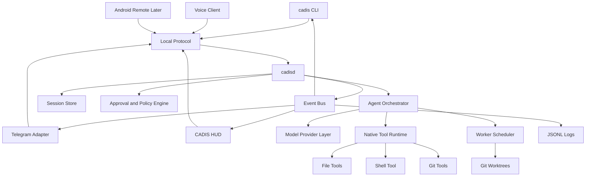
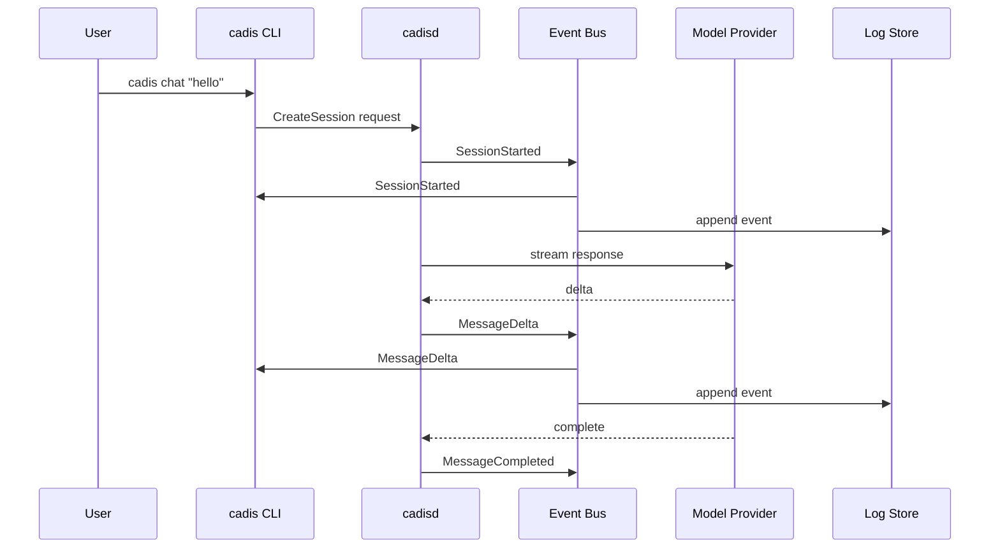
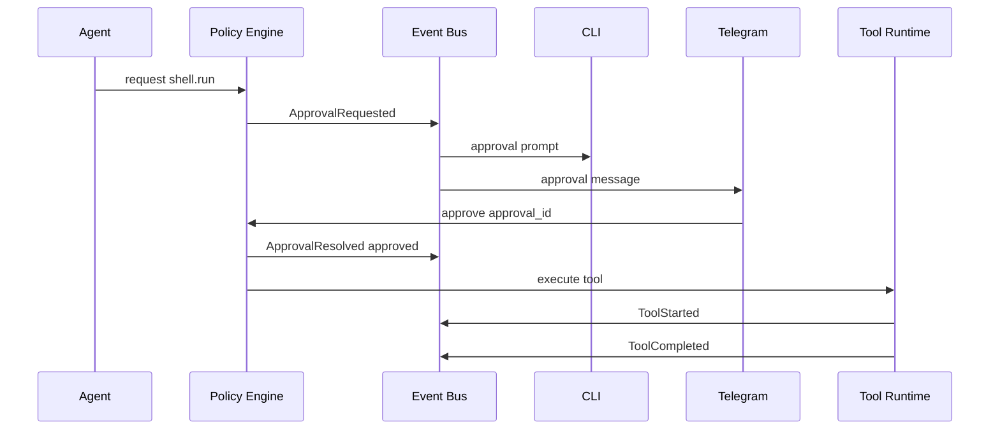

# CADIS Architecture

## 1. Architecture Summary

CADIS uses a daemon-first architecture. `cadisd` owns sessions, agents, tools, policy, event routing, persistence, and model interaction. All user interfaces are clients.

```text
                 Telegram
                    |
CLI ----------- local protocol ----------- HUD
                    |
                  cadisd
                    |
      +-------------+--------------+
      |             |              |
  Event Bus   Agent Runtime   Policy Engine
      |             |              |
  Persistence   Tools       Approvals
                    |
              Model Providers
```

## 2. High-Level Component Diagram



## 3. Runtime Boundary

### Core

- daemon
- local protocol
- event bus
- sessions
- model provider abstraction
- native tools
- policy engine
- persistence
- agent scheduler

### Adapters

- CLI
- Telegram
- HUD
- code work window
- voice
- model provider implementations
- optional MCP bridge later

Adapters may format, display, and relay events. They must not own business logic for tools, policy, or agent orchestration.

## 4. Request Flow



## 5. Approval Flow



Rules:

- Approval request is created before execution.
- Each approval has one authoritative state.
- First valid response wins.
- Denied or expired approvals do not execute.
- All clients receive the final state.

## 6. Coding Work Flow

```text
user task
  -> session created
  -> task classified as code-heavy
  -> code work context created
  -> worker created
  -> git worktree created
  -> coding agent edits in worktree
  -> tester runs tests
  -> reviewer checks diff
  -> code window shows patch and logs
  -> user approves apply
  -> patch applied to target workspace
```

The main conversation remains readable. Diffs, logs, and test output go to the code work window.

## 7. Event Model

Important event families:

```text
session.started
session.completed
message.delta
message.completed
agent.spawned
agent.status.changed
agent.completed
tool.requested
tool.started
tool.completed
tool.failed
approval.requested
approval.resolved
code.window.opened
patch.created
test.result
tts.started
tts.completed
error
```

All events must be serializable and durable enough for logs.

## 8. Content Routing

Every output should declare a content kind:

```text
chat
summary
code
diff
terminal_log
test_result
approval
error
```

Routing rules:

| Content kind | HUD | CLI | Telegram | Voice | Code Window |
| --- | --- | --- | --- | --- | --- |
| chat | Show | Show | Optional | Speak if enabled | No |
| summary | Show | Show | Push | Speak if enabled | Optional |
| code | Link | Link | Summary | Short summary only | Show |
| diff | Link | Link | Summary | No | Show |
| terminal_log | Link | Tail | Summary | No | Show |
| test_result | Show summary | Show summary | Push summary | Short summary | Show |
| approval | Card | Prompt | Buttons | Risk summary | Optional |
| error | Show | Show | Push | Actionable summary | Optional |

## 9. Agent Tree

Agents are represented as nodes:

```text
main
|-- coder
|   |-- tester
|   `-- reviewer
`-- researcher
```

Default limits:

```toml
[agents]
max_depth = 2
max_children_per_agent = 4
max_global_agents = 12
default_timeout_sec = 900
allow_recursive_spawn = false
```

## 10. Model Provider Layer

Provider interface responsibilities:

- stream response events
- expose capabilities
- map provider errors to CADIS errors
- support cancellation
- support tool call metadata when available

Initial providers:

- OpenAI
- Ollama
- Anthropic
- Gemini
- OpenRouter
- LM Studio
- custom HTTP

The provider contract should be proven with one cloud provider and one local provider before broad expansion.

## 11. Tool Runtime

Tools are native Rust components first.

Each tool declares:

- name
- description
- input schema
- output schema
- risk class
- workspace behavior
- timeout behavior
- cancellation behavior

MCP can be added later as an extension bridge, not as the default mechanism for core tools.

## 12. Persistence Architecture

```text
~/.cadis/
|-- config.toml
|-- sessions/
|   `-- <session-id>.json
|-- logs/
|   `-- <session-id>.jsonl
|-- workers/
|   `-- <worker-id>.json
|-- worktrees/
|   `-- <worker-id>/
|-- approvals.json
`-- tokens/
```

The store must protect against partial writes and log secret leakage.

Future memory architecture is tracked in `25_MEMORY_CONCEPT.md`. That concept
extends persistence with daemon-owned memory capsules, scoped Markdown memory,
SQLite metadata/FTS, append-only memory ledger events, ACL enforcement, and
optional local vector retrieval. It remains future work until accepted by a
decision record and protocol update.

## 13. Security Architecture

Security-sensitive behavior is centralized:

- policy engine classifies risk
- approval engine resolves permission
- tool runtime enforces policy result
- store redacts logs
- event bus distributes audit state

No adapter may bypass policy by executing tools directly.

## 14. Future Cross-Platform Notes

Linux starts with Unix sockets, POSIX shell behavior, and Linux-friendly desktop assumptions.

Windows and macOS need separate adapters for:

- shell execution
- path normalization
- sandboxing
- audio output
- local socket transport
- notifications

Android starts as a remote controller only.
